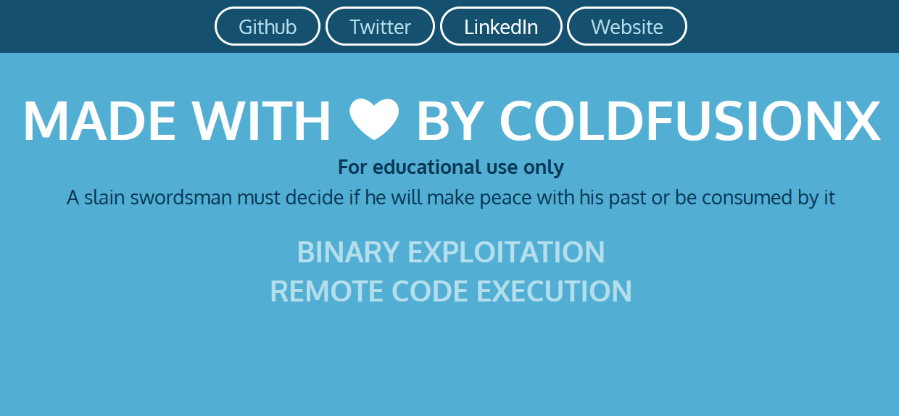

# Sample Nginx WebApp

Docker based Simple Web Application on Nginx server

# For Education Use only

#### Setting up the testing Environment

Prequistics: Installing docker and docker-compose on your system

For debain based distros ex. Ubuntu, Kali Linux etc. use the following commands

```shell
apt install docker.io
apt install docker-compose
```

For Windows,mac and other distros please refer the following guides:

- https://docs.docker.com/engine/install/
- https://docs.docker.com/compose/install/

Spinning the Image:

- Clone or download the repository
- run `docker-compose up -d`
- Your website should be up & running on http://localhost:8000/



